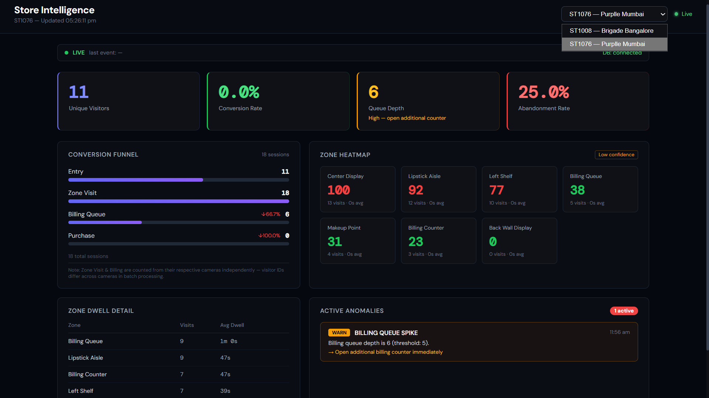
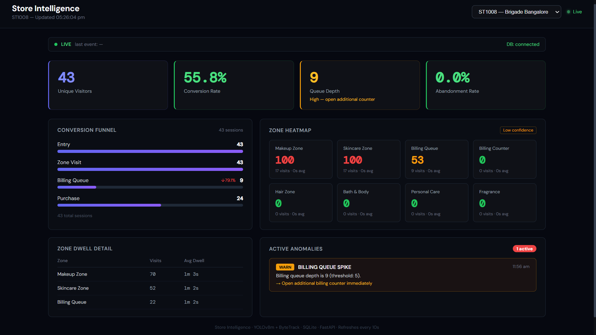

# Store Intelligence System

Real-time retail analytics from raw CCTV footage. A computer vision pipeline detects visitors, tracks movement across store zones, classifies staff vs customers, and exposes a live REST API with metrics, funnel analysis, heatmaps, and anomaly detection — across multiple stores from a single deployment.

---

## Dashboard

### ST1076 — Purplle Store 1076, Mumbai


Zone heatmap live with visit scores, queue depth alert, and active anomaly feed.

### ST1008 — Brigade Road, Bangalore


Heatmap showing Makeup Zone and Skincare Zone as highest-traffic areas, billing queue spike anomaly active.

---

## Quick Start (5 commands)

```bash
git clone <your-repo-url> store-intelligence-system
cd store-intelligence-system
cp data/POS_-_sample_transactions.csv data/pos_transactions_ST1008.csv
docker compose up --build -d api
curl http://localhost:8000/health
```

The API is live at `http://localhost:8000`. Swagger UI at `http://localhost:8000/docs`.

---

## Prerequisites

| Requirement | Notes |
|-------------|-------|
| Docker Desktop | Engine + Compose plugin also works |
| 8 GB RAM | 16 GB recommended for pipeline inference |
| NVIDIA GPU | Optional — strongly recommended for detection pipeline speed |
| Python 3.11+ | Only needed if running pipeline outside Docker |

---

## Repository Structure

```
store-intelligence-system/
├── pipeline/
│   ├── detect.py            # YOLOv8m + ByteTrack detection + tracking
│   ├── tracker.py           # Re-ID, group detection, zone/entry/exit logic
│   ├── emit.py              # Event builder — JSONL file and API batching
│   ├── zone_mapper.py       # Layout-driven centroid → zone_id mapping
│   ├── staff_classifier.py  # Per-store HSV colour-profile staff detection
│   ├── preprocess_pos.py    # Raw multi-SKU POS CSV → spec-compliant format
│   └── run.sh               # One command to process all clips for a store
├── app/
│   ├── main.py              # FastAPI entry point, CORS, structured logging
│   ├── models.py            # Pydantic v2 event schema + all response models
│   ├── database.py          # SQLAlchemy async ORM (events, sessions, POS, anomalies)
│   ├── ingestion.py         # POST /events/ingest — dedup, validate, persist
│   ├── metrics.py           # GET /stores/{id}/metrics
│   ├── funnel.py            # GET /stores/{id}/funnel
│   ├── heatmap.py           # GET /stores/{id}/heatmap
│   ├── anomalies.py         # GET /stores/{id}/anomalies
│   ├── health.py            # GET /health/detail — per-store feed status
│   └── pos_correlator.py    # POS CSV loader + visitor-session matching
├── data/
│   ├── store1_layout.json   # Zone grid for ST1008 (Brigade Road)
│   ├── store2_layout.json   # Zone grid for ST1076 (Purplle Mumbai)
│   └── pos_transactions_ST1008.csv
├── dashboard/
│   └── src/                 # React dashboard (Vite, localhost:3000)
├── terminal_dashboard/
│   └── terminal_dashboard.py  # Rich live terminal dashboard
├── tests/
│   ├── test_ingestion.py
│   ├── test_metrics.py
│   ├── test_funnel.py
│   ├── test_anomalies.py
│   ├── test_pipeline.py
│   └── test_staff_tracker.py
├── docs/
│   ├── DESIGN.md
│   ├── CHOICES.md
│   └── screenshots/
├── Dockerfile.api
├── Dockerfile.pipeline
└── docker-compose.yml
```

---

## Supported Stores

| Store ID | Name | City | Cameras |
|----------|------|------|---------|
| ST1008 | Brigade Road | Bangalore | CAM_1, CAM_2, CAM_3 (entry), CAM_4, CAM_5 (billing) |
| ST1076 | Purplle Store 1076 | Mumbai | CAM_ENTRY_1, CAM_ENTRY_2 (both entry), CAM_ZONE, CAM_BILLING |

---

## Running the API

### Docker (recommended)

```bash
# API only
docker compose up -d api

# API + terminal dashboard
docker compose --profile dashboard up -d

# Full stack (API + pipeline + dashboard)
docker compose --profile pipeline --profile dashboard up
```

### Local (no Docker)

```bash
pip install -r requirements.txt
export DATABASE_URL="sqlite+aiosqlite:///./db/store_intelligence.db"
mkdir -p db
uvicorn app.main:app --reload --port 8000
```

### React Dashboard

```bash
cd dashboard
npm install
npm run dev          # runs on http://localhost:3000
```

The dashboard polls the API every 15 seconds for heatmap data and uses SSE for live metrics and anomalies. Switch between stores from the dropdown — all panels update immediately.

---

## Running the Detection Pipeline

### Step 1 — Place clips

```
data/clips/
├── ST1008/
│   ├── CAM 1.mp4
│   ├── CAM 2.mp4
│   ├── CAM 3.mp4          ← entry camera
│   ├── CAM 4.mp4
│   └── CAM 5.mp4          ← billing camera
└── Store 2/
    ├── entry 1.mp4        ← entry camera 1
    ├── entry 2.mp4        ← entry camera 2
    ├── zone.mp4           ← floor camera
    └── billing_area.mp4
```

### Step 2 — Preprocess POS data

```bash
# Store 1
python pipeline/preprocess_pos.py \
    --input  "data/POS_-_sample_transactions.csv" \
    --output data/pos_transactions_ST1008.csv \
    --store-id ST1008

# Store 2 — no POS CSV required; queue_completed events drive conversion
```

### Step 3 — Run detection

```bash
# All Store 1 clips
bash pipeline/run.sh --store 1 --clips data/clips/ST1008

# All Store 2 clips
bash pipeline/run.sh --store 2 --clips "data/clips/Store 2"

# Single camera (faster for testing)
bash pipeline/run.sh --store 1 --clips data/clips/ST1008 --camera CAM_3

# Process and ingest directly into running API
bash pipeline/run.sh --store 2 --clips "data/clips/Store 2" --api-mode
```

Output: `output/<STORE_ID>_all_events.jsonl`

### Step 4 — Ingest events

If you didn't use `--api-mode`:

```bash
python3 - << 'EOF'
import json, httpx

events = [json.loads(l) for l in open("output/ST1076_all_events.jsonl")]
for i in range(0, len(events), 500):
    resp = httpx.post("http://localhost:8000/events/ingest",
                      json={"events": events[i:i+500]}, timeout=60)
    print(resp.json())
EOF
```

### Step 5 — Verify

```bash
curl http://localhost:8000/stores/ST1008/metrics | python -m json.tool
curl http://localhost:8000/stores/ST1076/metrics | python -m json.tool
curl http://localhost:8000/health/detail         | python -m json.tool
```

---

## API Reference

### `POST /events/ingest`

Accepts 1–500 events per call. Idempotent on `event_id`. Always returns HTTP 200 (partial failure reported in body).

```json
{
  "events": [{
    "event_id": "uuid-v4",
    "store_id": "ST1076",
    "camera_id": "CAM_ENTRY_1",
    "visitor_id": "VIS_c8a2f1",
    "event_type": "ENTRY",
    "timestamp": "2026-03-08T18:10:05Z",
    "zone_id": null,
    "dwell_ms": 0,
    "is_staff": false,
    "confidence": 0.91,
    "metadata": {
      "session_seq": 1,
      "gender_pred": "F",
      "age_bucket": "25-34",
      "group_id": "G_3",
      "group_size": 2
    }
  }]
}
```

```json
{"ingested": 1, "duplicate_skipped": 0, "failed": 0, "errors": []}
```

### `GET /stores/{store_id}/metrics`

Live metrics. Never returns null — falls back to most recent data window automatically.

```json
{
  "store_id": "ST1076",
  "unique_visitors": 11,
  "conversion_rate": 0.0,
  "current_queue_depth": 6,
  "abandonment_rate": 0.25,
  "avg_dwell_per_zone": [
    {"zone_id": "PURPLLE_MUM_1076_Z01", "avg_dwell_ms": 39000, "visit_count": 11}
  ]
}
```

### `GET /stores/{store_id}/funnel`

Conversion funnel. Re-entries never double-count (session-level deduplication).

```json
{
  "stages": [
    {"stage": "entry",         "count": 47, "drop_off_pct": 0.0},
    {"stage": "zone_visit",    "count": 44, "drop_off_pct": 6.4},
    {"stage": "billing_queue", "count": 18, "drop_off_pct": 59.1},
    {"stage": "purchase",      "count": 16, "drop_off_pct": 11.1}
  ],
  "session_count": 47
}
```

### `GET /stores/{store_id}/heatmap`

Zone visit frequency normalised 0–100. Returns only this store's zones — no cross-store bleed.

```json
{
  "zones": [
    {"zone_id": "PURPLLE_MUM_1076_Z02", "zone_name": "Center Display",
     "normalised_score": 100, "avg_dwell_ms": 0, "visit_count": 13},
    {"zone_id": "PURPLLE_MUM_1076_Z01", "zone_name": "Left Shelf",
     "normalised_score": 85,  "avg_dwell_ms": 39000, "visit_count": 11}
  ],
  "data_confidence": false
}
```

### `GET /stores/{store_id}/anomalies`

```json
{
  "anomalies": [{
    "anomaly_type": "BILLING_QUEUE_SPIKE",
    "severity": "WARN",
    "description": "Billing queue depth is 6 (threshold: 5).",
    "suggested_action": "Open additional billing counter immediately."
  }]
}
```

### `GET /health/detail`

Per-store feed status. Always HTTP 200.

```json
{
  "status": "healthy",
  "db_connected": true,
  "stores": [
    {"store_id": "ST1008", "last_event_at": "2026-04-10T14:22:10Z", "status": "OK"},
    {"store_id": "ST1076", "last_event_at": "2026-03-08T18:12:52Z", "status": "STALE_FEED"}
  ]
}
```

---

## Event Types

| Event | Trigger |
|-------|---------|
| `ENTRY` | Visitor crosses entry threshold inbound |
| `EXIT` | Visitor crosses entry threshold outbound |
| `REENTRY` | Re-ID match — same visitor returning after EXIT |
| `ZONE_ENTER` | Visitor centroid moves into a new zone |
| `ZONE_EXIT` | Visitor centroid leaves a zone |
| `ZONE_DWELL` | Visitor remains in zone for every 30s of continuous presence |
| `BILLING_QUEUE_JOIN` | Visitor enters billing zone while queue depth > 0 |
| `BILLING_QUEUE_ABANDON` | Visitor leaves billing zone with no POS transaction matched |

---

## Running Tests

```bash
pip install pytest pytest-asyncio httpx
pytest tests/ -v --tb=short
```

Covers: empty store (zero events), all-staff clip, zero purchases, re-entry deduplication in funnel, idempotent ingest, malformed batch partial success.

---

## Environment Variables

| Variable | Default | Description |
|----------|---------|-------------|
| `DATABASE_URL` | `sqlite+aiosqlite:////app/db/store_intelligence.db` | SQLAlchemy async connection string |
| `POS_CSV_DIR` | `/app/data` | Directory scanned for `pos_transactions_*.csv` files |
| `POS_CSV_PATHS` | _(empty)_ | Explicit comma-separated POS CSV paths (overrides scan) |
| `STORE_LAYOUT` | `/app/data/store_layout.json` | ST1008 layout path |
| `STORE_LAYOUT_ST1076` | `/app/data/store2_layout.json` | ST1076 layout path |
| `LOG_LEVEL` | `INFO` | Logging verbosity |
| `STORE` | `1` | Store number for pipeline container (1 or 2) |
| `CLIPS_DIR` | `/app/data/clips` | Clip directory for pipeline container |

---

## Acceptance Gate Checklist

- [ ] `docker compose up` starts the API with no manual steps beyond `git clone`
- [ ] `POST /events/ingest` returns 200 on valid payload
- [ ] `GET /stores/ST1008/metrics` returns valid JSON
- [ ] `GET /stores/ST1076/metrics` returns valid JSON
- [ ] `DESIGN.md` exists with AI-Assisted Decisions section (>250 words)
- [ ] `CHOICES.md` covers model selection, schema design, API architecture (>250 words)
- [ ] README explains detection pipeline → API in 5 commands